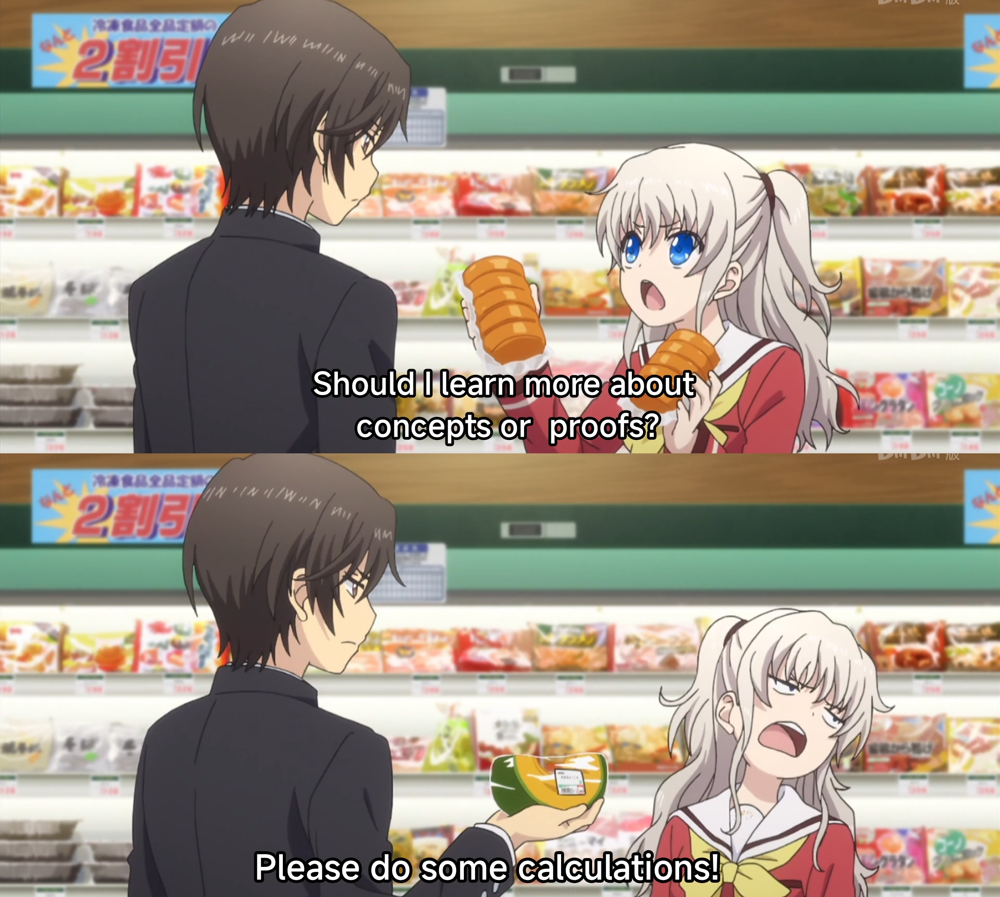

# MATH2850-TA-Material
This is the TA Material for the course MATH2850 (VV825) of Shanghai Jiao Tong University by Spark.

The materials covers the latter part of this course, which mainly includes the content including multi-variable calculus. Some topics covered by the recitation classes are listed as follows:

- Norms, Convergence, and Derivative
- Curves
- Multi-variable Integration
- Intro to Vector Calculus
- Extrema

The materials referenced the work of many previous MATH 2850 TAs, including TA-Yuxiang Chen, TA-Pingbang Hu, TA-Leyang Zhang, also, most importantly, the slides by Professor Horst Hohberger. If this material is lucky enough to be able to somewhat help you, it will be my honor.

Attached is a meme I think works well with this course:

